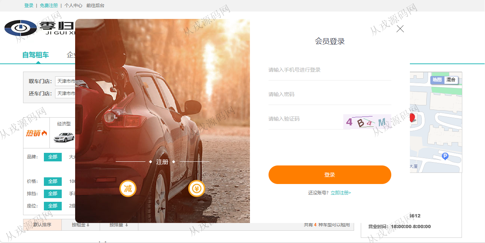
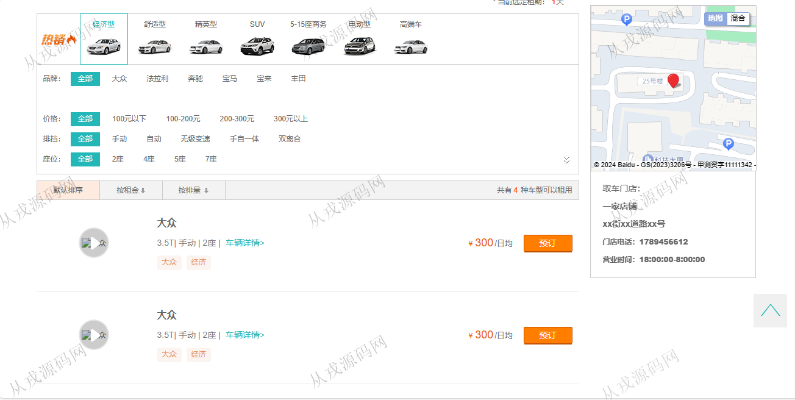
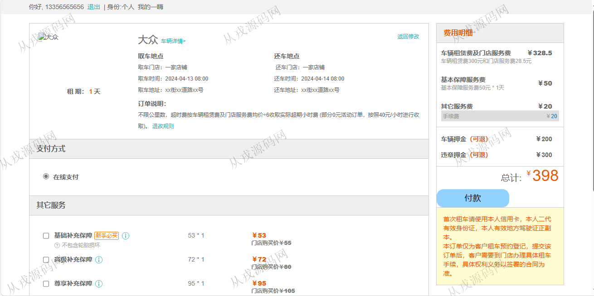
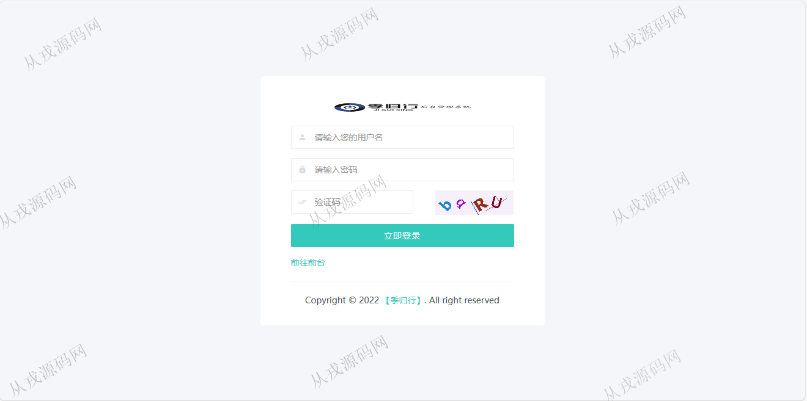
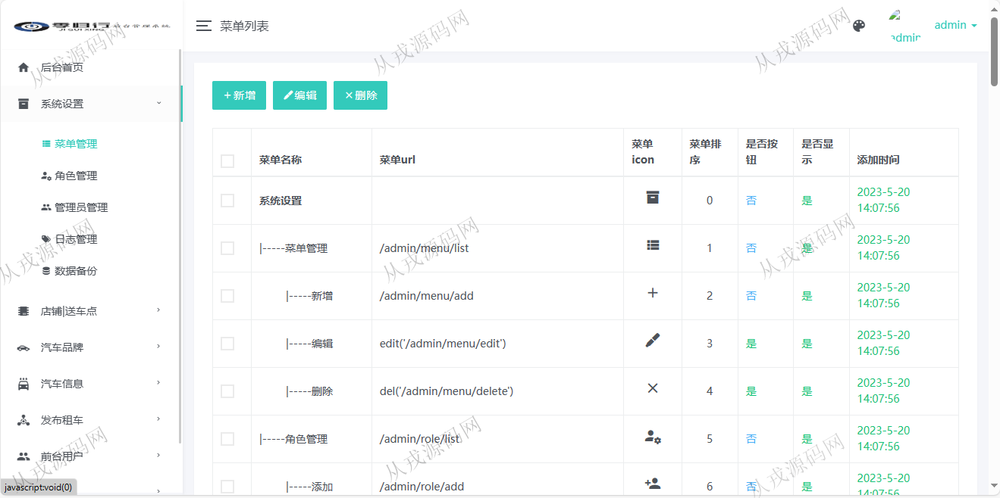
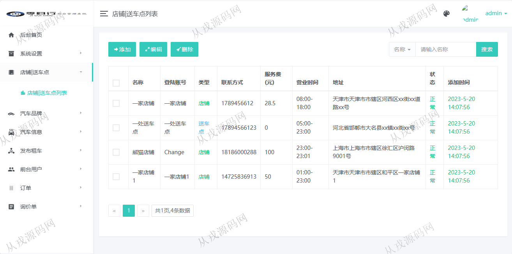
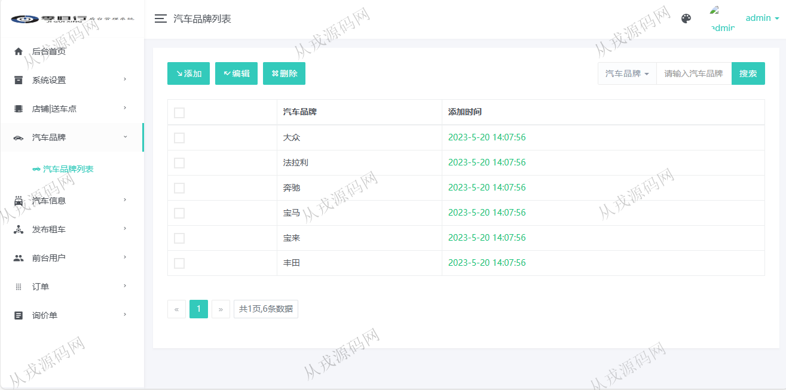
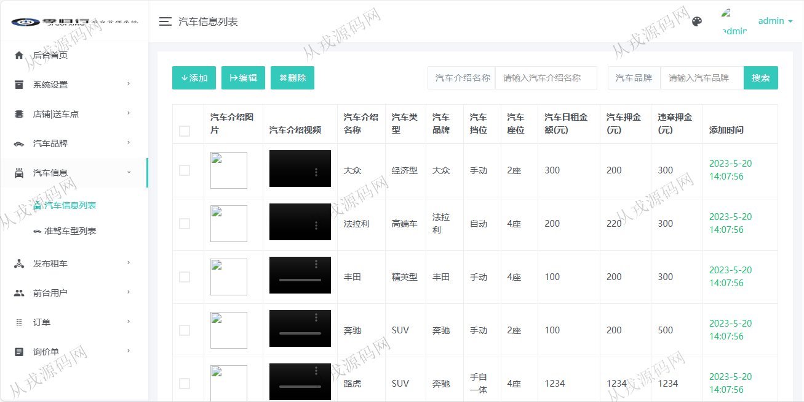

<div align="center">


# 🚗 Sistema de Gestión de Renta de Automóviles

### Plataforma de alquiler vehicular desarrollada con Spring Boot 🚀

<p align="center">
  <b>Car Rental Management System</b> es una plataforma web desarrollada con Spring Boot orientada a la administración de vehículos, reservas y servicios de renta, integrando funcionalidades modernas para usuarios y administradores.
</p>

<p align="center">
  
  
  
  
</p>

<p align="center">
  <a href="#-acerca-del-proyecto">Acerca</a> •
  <a href="#-módulos-del-sistema">Módulos</a> •
  <a href="#-características">Características</a> •
  <a href="#-tecnologías-utilizadas">Tecnologías</a> •
  <a href="#-vista-previa">Vista previa</a>
</p>

</div>

---

# 🌌 Acerca del proyecto

**Sistema de Gestión de Renta de Automóviles** es una plataforma web desarrollada con Spring Boot y MyBatis enfocada en la administración integral de servicios de alquiler de vehículos.

El sistema integra funcionalidades para clientes y administradores, permitiendo gestionar automóviles, reservas, servicios empresariales y consultas de pedidos desde una interfaz moderna y dinámica.

El sistema fue diseñado para:

- 🚗 Gestionar vehículos
- 👥 Administrar usuarios
- 📅 Gestionar reservas
- 📋 Supervisar pedidos
- 💳 Administrar alquileres
- 📊 Visualizar estadísticas
- 🔐 Gestionar accesos
- 🌐 Automatizar operaciones

---

# ✨ Características

## 🚘 Gestión vehicular

- 🚗 Registro de automóviles
- 📍 Gestión de disponibilidad
- 💰 Configuración de precios
- 📋 Información detallada
- ⚡ Administración dinámica

---

## 👥 Gestión de usuarios

- 👤 Registro e inicio de sesión
- 📄 Gestión de perfiles
- 🔐 Roles administrativos
- ⚡ Gestión centralizada
- 📊 Historial de operaciones

---

## 📅 Sistema de alquileres

- 📆 Reservas dinámicas
- 🚘 Servicios de renta
- 📋 Gestión de pedidos
- 💳 Administración de pagos
- ⚡ Confirmaciones rápidas

---

## 🏢 Servicios empresariales

- 🏢 Gestión corporativa
- 📊 Administración de servicios
- 🚗 Renta empresarial
- 📋 Seguimiento administrativo
- ⚡ Gestión centralizada

---

# 👨‍💼 Módulos del sistema

## 👤 User Module

Este módulo administra las operaciones de los clientes.

### Funcionalidades:

- 🚗 Buscar automóviles
- 📅 Reservar vehículos
- 📋 Consultar pedidos
- 💳 Gestionar alquileres
- 📄 Visualizar historial

---

## 🚘 Vehicle Module

Este módulo administra los vehículos del sistema.

### Funcionalidades:

- ➕ Registro de automóviles
- ✏️ Modificación de vehículos
- ❌ Eliminación de registros
- 📍 Gestión de disponibilidad
- 📋 Administración vehicular

---

## 📊 Order Module

Este módulo administra las reservas y pedidos.

### Funcionalidades:

- 📆 Gestión de reservas
- 📋 Consulta de pedidos
- 💳 Seguimiento de pagos
- ⚡ Confirmaciones rápidas
- 📄 Historial administrativo

---

## 🛠️ Admin Module

Este módulo funciona como administrador principal.

### Funcionalidades:

- 👥 Gestión de usuarios
- 🚗 Supervisión vehicular
- 📊 Dashboard administrativo
- 📅 Gestión de pedidos
- 🔐 Administración general

---

# 🛠️ Tecnologías utilizadas

## 🎨 Frontend

<p>
  
</p>

- HTML5
- CSS3
- JavaScript
- jQuery

---

## ⚙️ Backend

<p>
  
</p>

- Spring Boot
- Spring MVC
- Spring Framework
- MyBatis
- Maven
- Java 8

---

## 🗄️ Base de datos

<p>
  
</p>

- MySQL 5.7
- Relaciones SQL
- Persistencia de datos
- Gestión de reservas

---

## 🧰 Herramientas

<p>
  
</p>

- Git
- GitHub
- IntelliJ IDEA 2021.3
- Visual Studio Code

---

# 📂 Estructura del proyecto

```bash
Car-Rental-System/
│
├── src/                      # Código fuente Java
├── controller/               # Controladores Spring MVC
├── service/                  # Lógica de negocio
├── mapper/                   # MyBatis Mappers
├── entity/                   # Entidades
├── resources/                # Recursos y configuración
├── static/                   # Recursos frontend
├── templates/                # Plantillas HTML
├── screenshot/               # Capturas del sistema
├── pom.xml
├── README.md
└── LICENSE
```

---

# ⚡ Instalación

## 📋 Requisitos

- JDK 1.8
- Maven
- MySQL 5.7
- IntelliJ IDEA
- Navegador moderno

---

# 🚀 Configuración del proyecto

## 1️⃣ Clonar repositorio

```bash
git clone https://github.com/isairey/SpringBoot-Car-Rental-System.git
```

---

## 2️⃣ Configurar base de datos

Crear base de datos:

```bash
car_rental_system
```

---

## 3️⃣ Configurar conexión MySQL

Editar:

```bash
application.yml
```

Agregar:

```yaml
spring:
  datasource:
    url: jdbc:mysql://localhost:3306/car_rental_system
    username: root
    password: root
```

---

## 4️⃣ Instalar dependencias

```bash
mvn clean install
```

---

## 5️⃣ Ejecutar proyecto

```bash
mvn spring-boot:run
```

---

## 6️⃣ Abrir aplicación

```bash
http://localhost:8080
```

---

# 📊 Funcionalidades principales

## 🚗 Gestión vehicular

- Administración de automóviles
- Gestión de disponibilidad
- Configuración de tarifas
- Control de alquileres

---

## 👥 Administración de usuarios

- Registro y autenticación
- Gestión de perfiles
- Roles administrativos
- Historial de actividad

---

## 📅 Gestión de reservas

- Reservas dinámicas
- Confirmaciones rápidas
- Gestión de pedidos
- Seguimiento financiero

---

# 📸 Vista previa

## 🖥️ Interfaces del sistema

<div align="center">

### 🚗 Página principal


### 🔐 Inicio de sesión


### 🚘 Gestión de vehículos


### 📅 Gestión de reservas


### 👥 Gestión de usuarios


### 📊 Dashboard administrativo


### 📋 Gestión de pedidos


### 💳 Servicios empresariales


### ⚙️ Configuración del sistema


</div>

---

# 🧠 Objetivos del proyecto

## 🎯 Aprendizaje y administración

- Desarrollo backend con Spring Boot
- Arquitectura MVC
- Integración MyBatis
- Gestión de bases de datos
- Automatización de reservas
- Sistemas administrativos
- Programación empresarial Java

---

# 🚧 Roadmap

## 🔮 Próximas mejoras

- 📱 Aplicación móvil
- ☁️ Infraestructura cloud
- 💳 Integración de pagos online
- 🤖 Reportes inteligentes
- 🌐 API REST moderna
- 🔔 Notificaciones en tiempo real
- 📍 Seguimiento GPS

---

# 🤝 Contribuciones

Las contribuciones son bienvenidas ❤️

## Cómo contribuir

1. Fork del proyecto

```bash
git checkout -b feature/nueva-funcionalidad
```

2. Commit

```bash
git commit -m "✨ Nueva funcionalidad"
```

3. Push

```bash
git push origin feature/nueva-funcionalidad
```

4. Pull Request 🚀

---

# 👨‍💻 Desarrollador

<div align="center">

## Isai Reyes — Java & Spring Developer

Desarrollador apasionado por plataformas empresariales, sistemas administrativos y aplicaciones Spring Boot 🚀

</div>

---

# 🌟 Apoya el proyecto

⭐ Dale una estrella  
🍴 Haz fork  
📢 Comparte el proyecto

---

# 📜 Licencia

Proyecto open source orientado al aprendizaje de Spring Boot, MyBatis y administración de sistemas de renta vehicular.

---

<div align="center">

### 🚗 Sistema de Gestión de Renta de Automóviles — administración inteligente de vehículos y reservas 🚀

</div>
